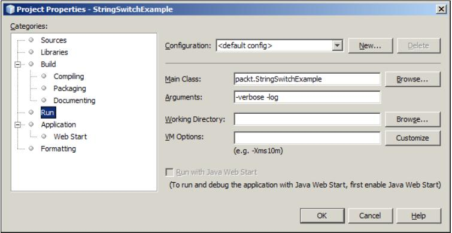

### 在switch语句中使用字符串

Java 7中可以在*switch*语句中使用字符串，以前只有整形可以作为*switch*的有些参数。基于*string*值进行判断是很常见的，使用*switch*语句可以简化一系列的*if*语句，从而也是代码更高效和具有阅读性。

#### 准备

在一个应用中可能发生基于*string*值的选择，在这种场景下，需要如下做：

* 创建一个将由*switch*语句处理的*String*变量
* 创建*switch*块，在*case*子句中使用字符串字面量
* 使用*String*变量来控制*switch*语句

#### 动手

下面的例子使用*switch*语句来处理程序的命令行参数。创建一个控制台应用，在*main*方法中，使用*args*参数来处理命令行参数。许多应用都允许通过命令行参数来定制或影响应用的运行。此例中，应用会支持*verbose*模式，*logging*模式，提供关于应用合法参数的帮助信息。

1、新建类*StringSwitchExample*，处理通过命令行设置的三个实例变量，如下：

```java
public class StringSwitchExample {
    private static boolean verbose = false;
    private static boolean loggging = false;
    private static boolean displayHelp = false;
}
```

2、在*main*方法中添加如下代码，它基于指定的命令行参数设置变量值：

```java
    public static void main(String[] args) {

        for (String argument : args) {
            switch (argument) {
            case "-verbose":
            case "-":
                verbose = true;
                break;
            case "-log":
                logging = true;
                break;
            case "-help":
                displayHelp = true;
                System.out.println("Illegal command line argument");
            default:
                break;
            }
        }
        displayApplicationSettings();
    }
```

3、下面的代码用来显示应用的设置：

```java
    private static void displayApplicationSettings() {
        System.out.println("Application Settings");
        System.out.println("Verbose: " + verbose);
        System.out.println("Logging: " + logging);
        System.out.println("Help: " + displayHelp);
    }
```

4、在命令行如下执行程序：

    java StringSwitchExample -verbose -log

5、如果使用IDE，也都会提供设置命令行参数的方法。例如在NetBeans中，在*Project*窗口右键点击工程的名字，选择*Properties*菜单会打开一个* Project Properties *窗口，在*Run*一栏中，*Arguments*文本框可以输入命令行参数，例如如下的截屏：



6、执行程序，输出如下：

    Application Settings
    Verbose: true
    Logging: true
    Help: false

#### 原理

应用初始的设置属性都被初始化为*false*，*for-each*循环中依次迭代每一个命令行参数，*switch*语句使用指定的命令行参数打开对应的应用设置。*switch*语句的行为类似以前Java中的*switch*语句。

    备注：有趣的是当前的Java虚拟机(JVM)并不直接支持使用字符串的*switch*语句，而是由Java编译器负责将*switch*语句中的字符串转换为对应的字节码。

在*for loop*语句之后，执行*displayApplicationSettings*方法，它显示了程序当前的、由命令行参数指定的设置。

需要注意的是，虽然*String*变量可以像其他那些可以用在*switch*语句中数据类型一样用在*switch*语句中，但是*case*子句中的字符串必须是字符串字面量。在*switch*语句中使用字符串的一般规则是：在*switch*语句里的每个子句必须有一个不为NULL的字符串字面量标签，不能有两个是一样的，只能有一个默认值。

#### 更多

在*switch*语句中使用字符串时，还需要注意如下问题：

    Null值

在*switch*语句中使用一个Null值的字符串应用会导致*java.lang.NullPointerException*异常，关于如何处理空指针请参考*第十一章 拾遗*中的*处理空引用*一节。另外，*case*子句中字符串是区分大小写的。在前面的例子中，如果命令行参数和*case*子句中的字符串的大小写不一致，对应的*case*子句会被因为不匹配而被跳过。如果使用如下的命令行参数，*verbose*的首字母大写：

    java StringSwitchExample -Verbose -log

那么*verbose*模式将不会被使用，输出如下：

    Application Settings
    Verbose: false
    Logging: true
    Help: false

