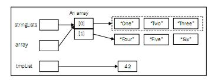
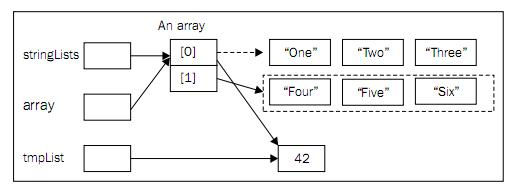

### 使用@SafeVarargs注解

注解*@SafeVarargs*和*@SuppressWarnings*用于处理通常不必要的警告。*@SuppressWarnings*，抑制警告，它会抑制指定的警告类型。

*@SafeVarargs*在Java 7中引入，用于指明那些使用可变长度参数的方法和构造器是安全的。这些方法能被传入长度可变的参数。这些参数可以是泛型的。如果它们是泛型参数，使用*@SafeVarargs*注释就可以抑制那些烦人的警告信息。

#### 准备

*@SafeVarargs*在构造器和方法上使用。根据如下步骤使用*@SafeVarargs*注解：

1. 重建使用可变长度泛型参数的方法或构造器
2. 在方法的声明前加上*@SafeVarargs*注解

#### 动手

1、重建如下包含*displayElements*方法的一个程序来演示*@SafeVarargs*的用法。这个方法显示了它的每一个参数的信息以及它对应的值：

```java
public class SafeVargExample {

    public static void main(String[] args) {
    }

    @SafeVarargs
    public static <T> void displayElements(T... array) {
        for (T element : array) {
            System.out.println(element.getClass().getName() + ":" + element);
        }
    }
}
```

方法*displayElements*的形参是可变长度的泛型类型。Java使用对象数组来实现可变长度参数，而数组只能持有reifable类型。在*原理*一节会讨论reifable类型。

2、在*main*方法中加上如下代码来测试*displayElements*方法：

```java
        ArrayList<Integer> a1 = new ArrayList<>();
        a1.add(new Integer(1));
        a1.add(2);

        ArrayList<Float> a2 = new ArrayList<>();
        a2.add(new Float(3.0));
        a2.add(new Float(4.0));

        displayElements(a1, a2, 12);
```

3、运行程序，输出如下：

    java.util.ArrayList:[1, 2]
    java.util.ArrayList:[3.0, 4.0]
    java.lang.Integer:12

4、注意在声明*java.util.ArrayList*时使用了菱形符号。这个符号是Java 7新加入的，关于它的讨论放在:*使用菱形符号来进行类型推断* 一节。

#### 原理

在Java中，使用三个点号(*...*)来创建可变长度参数的方法或构造器，如*displayElements*方法。在这个例子中，类型是泛型的。

问题是泛型缺乏和数组一块优雅工作的能力。当泛型在Java 1.5中被引入时，它被设计为能和以前的代码向后兼容。泛型的实现使用了类型擦除。也就是说，任何在编译时有效的类型信息在运行时都被擦除了。这些信息为* non-reifable*。

数组是具体化的。数组的元素型信息是被保留的，可以在运行时使用它们。注意，声明一个泛型数组是不可能的。可以如下创建一个字符串数组：

```java
        String arr[] = {"First", "Second"};
```

但是不能创建一个泛型数组，比如这样：

```java
        List<String> list1 = new ArrayList<String>();
        list1.add("a");
        List<String> list2 = new ArrayList<String>();
        list2.add("b");
        List<String> arr[] = {list1, list2}
```

这段代码会导致一个编译错误：

**Cannot create a generic array of List<String>**

方法使用的可变类型参数是用一个对象数组来实现的，它只能处理具体类型。当使用可变类型参数的方法被调用时，将会创建一个数组用于存放这些参数。

一旦方法使用可变长度泛型参数，在运行时就可能导致*heap pollution*问题。当一个参数化类型的变量被赋一个和于它定义时类型不同的值时，就会发生*heap pollution*。在编译时，它会导致一个未检查的警告。在运行时，会导致一个* java.lang.ClassCastException*异常。使用*@SafeVarargs*注解来指明对应方法可以避免*heap pollution*。

使用可变长度泛型参数的方法在编译时会得到一个警告。但是，并不是所有使用可变长度泛型参数的方法都会导致运行时异常。*@SafeVarargs*就被用来指明它所标记的方法是安全的。如果方法可能在运行期发生异常，那么就不应该使用这个注解。下一节将更进一步的讨论。

如果没有使用*@SafeVarargs*注解，那么编译器将会生成如下的警告：

**warning: [unchecked] unchecked generic array creation for varargs parameter of type ArrayList<? extends INT#1>[]**
**warning: [unchecked] Possible heap pollution from parameterized vararg type T**

第一个警告在*displayElements*方法被调用时发生，第二个警告在*displayElements*方法上。但是这些代码一点也没错，所以抑制这些警告完全是可以接受的。

也可以使用*@SuppressWarnings("unchecked")*注解替代*@SafeVarargs*来抑制警告，但是在使用方法时仍然会产生警告。使用*@SafeVarargs*同时抑制这两处的警告。

#### 更多

还有：

* Java核心类库中对*@SafeVarargs*的使用
* 一个*heap pollution*例子

**Java核心类库中对*@SafeVarargs*的使用**

JDK 1.7类库中已经使用*@SafeVarargs*主机修改了一下方法，包括：

* public static <T> List<T> java.util.Arrays.asList(T... a)
* public static <T> boolean java.util.Collections.addAll(Collection<? super T> c, T... elements)
* public static <E extends Enum<E>> java.util.EnumSet<E> EnumSet.of(E first, E... rest)
* protected final void javax.swing.SwingWorker.publish(V... chunks)

这些方法都使用了*@SafeVarargs*注解来表明它们不会引起* heap pollution*，它们被认为是安全的。

**一个*heap pollution例子**

一些方法不应该被标记为安全的，下面这个例子使用*@SafeVarargs*注解的javadoc中的代码改造而成。

在代码中加入如下的方法：

```java
    @SafeVarargs // Not actually safe!
    public static void merge(List<String>... stringLists) {
        Object[] array = stringLists;
        List<Integer> tmpList = Arrays.asList(42);
        array[0] = tmpList; // Semantically invalid, but compiles without warnings
        String element = stringLists[0].get(0); // runtime ClassCastException
    }
```

使用下面的代码测试这个方法：

```java
        List<String> list1 = new ArrayList<>();
        list1.add("One");
        list1.add("Two");
        list1.add("Three");

        List<String> list2 = new ArrayList<>();
        list2.add("Four");
        list2.add("Five");
        list2.add("Six");

        merge(list1, list2);
```

运行程序将会得到如下的错误信息：

**Exception in thread "main" java.lang.ClassCastException: java.lang.Integer cannot be cast to java.lang.String**

字符串列表*stringList*被传递给方法*merge*，接下来声明了一个对象数组，并且通过*stringList*指向相同的对象引用。这时候，*stringList*和*array*指向相同的对象：一个字符串的* java.util.List*。下面说明了此时的内存情况：



接下来的赋值操作：

    array[0] = tmpList;

*tmpList*被赋值给数组的第一个元素，下面的图形说明了这次赋值之后的情形：



此时，已经有效的将一个*Integer*对象赋值给了一个*String*类型的变量。虚线显示了旧的引用。在运行时，当试图将这个*Integer*对象赋值给一个*String*类型的变量时，就会发生*ClassCastException*异常。

这个方法导致了*heap pollution*问题，它不应该使用*@SafeVarargs*注解标记，因为它不是安全的。因为可以简单的将一个*List<Integer>*对象赋值给一个*Object*变量，所以将*tmpList*赋值给第一个数组的元素是允许的。这是向上转型(**upcasting**)的例子，这在java中是合法的。

#### 其他
前面的例子中使用了用于构造器类型推断的菱形符号，它改进了泛型的使用方法。