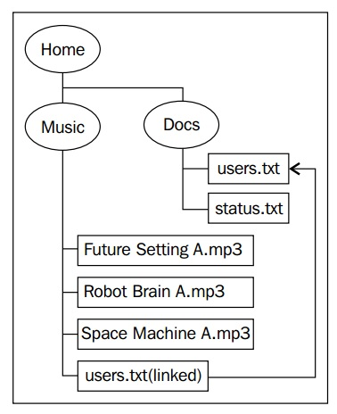

#### 介绍

文件系统是计算机组织数据的一种方式。通常一个文件系统会包含一个或多个顶级目录，每个目录下会包括一组层型的文件。顶级目录通常称做根目录。此外，文件系统存储在被称之为文件存储器的介质上。

**Java 7**中增加了很多新的类和接口，通过它们可以更有效和更简单的来操作文件系统。这些新加的类和接口在很大程度是对以前**java.io**包下的类做的功能补充。

在本节及以后的章节中，将使用如下一个目录结构来分析如何管理文件系统：

图中椭圆表示目录/文件夹，长方形表示文件。Unix和Windows系统在根节点的支持上有所不同，Unix系统支持单根节点，而Windows系统则允许存在多个根节点。使用路径来描述文件或目录的位置，路径中的元素通过斜杠或反斜杠来分割。Unix使用斜杠（/），Windows使用反斜杠（\）。

图中的音乐文件来自*http://freepd.com/70s%20Sci%20Fi/*。 *status.txt*文件记录了一些简单的状态信息，*users.txt*文件里记录了一组用户信息。*Music*目录下的*users.txt*是*docs*目录下对应文件的一个符号链接。这些文件将在本章的例子中被反复使用到，当然你也可以使用任何你喜欢的文件或文件结构。

符号链接在在Unix系平台上比较普遍。（在Windows平台）给*Music*目录下的*users.txt*创建一个符号链接，可以cmd下使用命令：*mklink users.txt c:\home\docs\users.txt*，执行这个命令需要管理员权限。

本章主要关注*java.nio.file.Path*类表示的路径相关的操作。*Path*在*java.nio*包里广泛使用，它由以下几部分组成：

* 根路径：用来表示基本路径，比如C盘
* 分隔符：用来区分组成目录或文件名路径的不同部分的名字
* 中间目录的名字
* 最后一个元素，它可以是一个文件或目录

在*理解路径*一节会详细讨论以上的问题。下面的类用来处理文件和目录相关的操作：

* *java.nio. file.Paths*：包含用来创建*Path*对象的静态方法
* *java.nio. file.Path*：此接口包含了很多用来操作路径的方法
* *java.nio. file.FileSystems*：访问文件系统的基础类
* *java.nio. file.FileSystem*：表示一个文件系统，比如Unix下的/或者Windows下的C盘
* *java.nio. file.FileStore*：表示实际的存储设备，提供设备相关的信息
* *java.nio. file.attribute.FileStoreAttributeView*：提供访问文件信息

最后两个类会在随后的章节中深入讨论。要访问文件或者目录，一般会使用*FileSystem*类的*getDefault*方法来获取一个文件系统的引用；要访问某磁盘，可以使用一个表示磁盘或目录的*统一资源定位器（URI：Uniform Resource Identifer）来调用*getFileSystem*方法。

*FileSystems*类提供了创建或者访问文件系统的方式。本节我们只关心那些可以用来创建*Path*对象的类。一旦持有某个文件系统的引用，就可以通过下面任意一个方法来获取一个*Path*对象：

* *getPath*：使用一种系统无关的方式来获取一个*Path*对象，*Path*对象可以用来定位和访问文件。
* *getPathMatcher*：创建一个*getPathMatcher*对象，通过它可以在文件上进行各种匹配操作，在*第五章 获取文件系统信息*一节我们会讨论它。
* *getRootDirectories*：用于获取根目录列表，在*第五章 获取文件系统信息*一节我们会讨论此方法。

*Path*对象的创建和基本使用会在*理解路径*一节详细介绍，接下来的内容和随后的章节，会频繁的用到路径相关的知识，所以要认真理解此节的内容。

仍然可以使用旧的*java.io*中的内容，可以通过*File*类的*toPath*方法来创建与之关联的路径，在*java.io.File和java.nio.file.Files之间的互操作*一节会具体讨论，在维护旧代码时，这些方法非常有用。

路径可以时相对的，也可以是绝对的，在*Working with relative and absolute paths*一节会讨论这些。

路径可以包括冗余或额外的元素，删除这些冗余或额外的操作就叫做*normalization*，在*通过normalize来移除路径中的冗余元素*一节会讨论这些。

多个路径组合起来可以形成一个新的路径，这种方式叫解析路径，在*使用路径解析来连接不同的路径*一节会讨论这些。在创建新路径时这非常有用。

文件的引用，有时是相对当前或者某个位置。在*通过两个路径创建一个新路径*一节会讨论这种路径的创建方式，这个过程叫做"相对化"。

不仅有相对路径和决定路径，还有其他方式表示的路径，比如用*java.net.URI*表示的。创建一个*Path*对象，不意味它所表示的路径就真实存在。在*不同类型路径之间转换*一节讨论在不同类型路径之间转换的方式。

路径是系统相关的，Unix下一个同样的路径在Windows下是不同的，在*检查两个路径是否是相等的*一节会讨论这些。

<END>