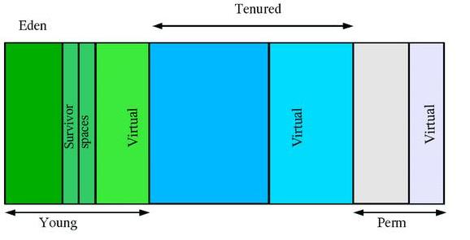

# 再遇OOM #
OOM并不常见，以前遇到的几次只是随手改掉，并没有总结详细的原因和解决方式。这次在分析消息缓存时，在特定场景下，一下子跑出好几个OOM，且错误消息都不一样：

1. java.lang.OutOfMemoryError: Java heap space
2. java.lang.OutOfMemoryError:
    at java.io.RandomAccessFile.readBytes(Native Method)
3. java.lang.OutOfMemoryError: GC overhead limit exceeded
4. java.lang.OutOfMemoryError: unable to create new native thread

第一种类型比较常见，后面几种类型并不常见。这次在FIX BUG的同时，打算对OOM进行一次较为深入的调查。本文记录了所有的调查结果，基于JDK 1.7和OpenJDK7.

# HotSpot VM的GC机制 #
JVM规范要求一个JVM实现必须包括一个垃圾收集器来回收无用对象。基于以下两个假设：

1. 大多数分配的对象会很快变得不可达
2. 只有很少的引用由老对象指向新生的对象

这两个假设被称为*弱年代假设*(绝大多数分配的对象会很快变得不可达)，实际中的系统也绝大数符合这两个假设描述的情况。基于以上假设，HotSpot VM采用分代垃圾收集机制，把JVM堆划分为两个物理区域：新生代(young generation)和老年代(old generation)，基本机构如下：



从上图可以看到，JVM堆实际上被划分为3个区域：

1. ** 新生代：**
绝大多数最新创建的对象都会被分配到新时代，与堆相比，新时代一般较小并且垃圾收集活动频繁。既然大部分对象在创建后会很快变得不可达，所以在一次新生代GC后，依然存活的对象的数量比较少了。新生代GC的特点是gc区域较小、gc次数频繁、且gc时间快速。进一步的，新生代又被分为伊甸园(Eden)和两段幸存者间（Survivor Space），刚刚分配的对象一般会位于伊甸园区，幸存者空间用于保存上次Minor GC之后依然存活的对象，进过几轮Minor GC依然存活的对象将会被转移至老年代。新生代GC也称为minor gc。

2. ** 老年代：** 
经过Minor GC依然存活的对象将会被放进（称为"promoted"或"tenured"）老年代。通常老年代会比新生代大，并且老年代的增长也会比较缓慢，对应的老年代的GC频率较低、并且时间会较长。老年代GC称为major gc或full gc。

3. ** 永久代：**
可以不把永久代看作分代层次中的一部分，只有HotSpot VM本身会使用永久代，主要用于保存元数据信息，比如类信息、字符串缓存等等。用户分配的对象不会被放到永久代的。

至JDK1.7为止，HotSpot VM一共支持4种垃圾收集器：

1. ** Serial GC：**
串行收集器只适用于单核CPU机器，它只使用一个线程执行GC。串行收集器不应该被使用在服务器应用上。一个可能的使用场景是需要在一个机器上起很多个JVM，此时可以考虑使用串行收集器。

2. ** Parallel GC：**
并行收集器使用多个线程执行GC，适合内存充足、多核的场景，由于它吞吐量优先，所以也称为"throughput gc"。早期版本的Parallel GC对老年代的GC依然是串行执行的，JDK 1.5之后，可以使用**Parallel Old GC**，老年代的GC也可以配置为并行执行，与Parallel GC相比，唯一的区别在于针对老年代的GC算法上，Parallel Old GC分为三步：标记-汇总-压缩(*mark-summary-compaction*)，汇总与清理（sweep）的不同之处在于，它将依然幸存

3. ** Mostly-Concurrent GC(CMS)：**
CMS收集器是一种以获取最短回收停顿时间为目标的收集器，也是一种并发收集器，采用Mark-Sweep算法，使用于响应时间时间要求比较苛刻的场景。CMS会比其他GC收集器占用更多的内存和CPU。

4. ** G1: **
G1收集器在JDK1.6提出，JDK1.7已经成熟，是目前最新的GC收集技术，它可以充分利用多核环境。G1最大的好处是性能，理论上它比上面讨论过的任何一种GC都要快，但是在生产环境中使用还是需要慎重测试。

# 几种OOM的原因 #
下面依次分析最开始几种OOM的原因。

** 1. java.lang.OutOfMemoryError: Java heap space **

一看到Java heap space就知道是JVM堆内存不足了。那从上面GC机制我们知道，堆分为新生代、老年代和持久代，那到底是哪儿不足会引起OOM呢？看看JVM是怎么做的吧。

* hotspot\src\share\vm\gc_interface\collectedHeap.inline.hpp *
```cpp
HeapWord* CollectedHeap::common_mem_allocate_init(KlassHandle klass, size_t size, TRAPS) {
  HeapWord* obj = common_mem_allocate_noinit(klass, size, CHECK_NULL);
  init_obj(obj, size);
  return obj;
}

HeapWord* CollectedHeap::common_mem_allocate_noinit(KlassHandle klass, size_t size, TRAPS) {

  // Clear unhandled oops for memory allocation.  Memory allocation might
  // not take out a lock if from tlab, so clear here.
  CHECK_UNHANDLED_OOPS_ONLY(THREAD->clear_unhandled_oops();)

  if (HAS_PENDING_EXCEPTION) {
    NOT_PRODUCT(guarantee(false, "Should not allocate with exception pending"));
    return NULL;  // caller does a CHECK_0 too
  }

  HeapWord* result = NULL;
  if (UseTLAB) {
    result = allocate_from_tlab(klass, THREAD, size);
    if (result != NULL) {
      assert(!HAS_PENDING_EXCEPTION,
             "Unexpected exception, will result in uninitialized storage");
      return result;
    }
  }
  bool gc_overhead_limit_was_exceeded = false;
  result = Universe::heap()->mem_allocate(size,
                                          &gc_overhead_limit_was_exceeded);
  if (result != NULL) {
    NOT_PRODUCT(Universe::heap()->
      check_for_non_bad_heap_word_value(result, size));
    assert(!HAS_PENDING_EXCEPTION,
           "Unexpected exception, will result in uninitialized storage");
    THREAD->incr_allocated_bytes(size * HeapWordSize);

    AllocTracer::send_allocation_outside_tlab_event(klass, size * HeapWordSize);

    return result;
  }


  if (!gc_overhead_limit_was_exceeded) {
    // -XX:+HeapDumpOnOutOfMemoryError and -XX:OnOutOfMemoryError support
    report_java_out_of_memory("Java heap space");

    if (JvmtiExport::should_post_resource_exhausted()) {
      JvmtiExport::post_resource_exhausted(
        JVMTI_RESOURCE_EXHAUSTED_OOM_ERROR | JVMTI_RESOURCE_EXHAUSTED_JAVA_HEAP,
        "Java heap space");
    }

    THROW_OOP_0(Universe::out_of_memory_error_java_heap());
  } else {
    // -XX:+HeapDumpOnOutOfMemoryError and -XX:OnOutOfMemoryError support
    report_java_out_of_memory("GC overhead limit exceeded");

    if (JvmtiExport::should_post_resource_exhausted()) {
      JvmtiExport::post_resource_exhausted(
        JVMTI_RESOURCE_EXHAUSTED_OOM_ERROR | JVMTI_RESOURCE_EXHAUSTED_JAVA_HEAP,
        "GC overhead limit exceeded");
    }

    THROW_OOP_0(Universe::out_of_memory_error_gc_overhead_limit());
  }
}
```
如果Universe::heap()->mem_allocate放回为NULL，即分配失败，就发生了OOM。继续看Universe::heap()->mem_allocate做了什么事：

*  *
```cpp
```

TODO

** 2. java.lang.OutOfMemoryError: at java.io.RandomAccessFile.readBytes(Native Method) **

出现这个OOM时，测试Java启动时配置的Xmx和Xms不相等，前者为512M，后者为256M，也就是说JVM Heap随着需要进行增大，但是前提时在进行增长时系统必须有足够的物理内存。一旦物理内存不足，会怎么样呢？OpenJDK的源码处理如下：

* jdk\src\share\native\java\io\RandomAccessFile.c
```cpp
JNIEXPORT jint JNICALL
Java_java_io_RandomAccessFile_readBytes(JNIEnv *env,
    jobject this, jbyteArray bytes, jint off, jint len) {
    return readBytes(env, this, bytes, off, len, raf_fd);
}
```

* jdk\src\share\native\java\io\io_util.c
```cpp
jint
readBytes(JNIEnv *env, jobject this, jbyteArray bytes,
          jint off, jint len, jfieldID fid)
{
    jint nread;
    char stackBuf[BUF_SIZE];
    char *buf = NULL;
    FD fd;
......
    if (len == 0) {
        return 0;
    } else if (len > BUF_SIZE) {
        buf = malloc(len);
        if (buf == NULL) {
            JNU_ThrowOutOfMemoryError(env, NULL);
            return 0;
        }
    } else {
        buf = stackBuf;
    }
......
}
```

也就是说：在调用JNI方法时，一旦系统的物理内存不足也会抛出OOM的异常。使用JNU_ThrowOutOfMemoryError大致搜索了一下，可能会OOM的地方比想的多的多的多：

    正在处理文件: \jdk\src\macosx\native\sun\awt\CRobot.m
    Line 121 -             <JNU_ThrowOutOfMemoryError>(env, NULL);
    找到 1  处。
    正在处理文件: \jdk\src\macosx\native\sun\awt\LWCToolkit.m
    Line 210 -         <JNU_ThrowOutOfMemoryError>(env, NULL);
    找到 1  处。
    正在处理文件: \jdk\src\macosx\native\sun\java2d\opengl\CGLSurfaceData.m
    Line 421 -         <JNU_ThrowOutOfMemoryError>(env, "creating native cgl ops");
    找到 1  处。
    正在处理文件: \jdk\src\share\native\common\jni_util.c
    Line  67 - <JNU_ThrowOutOfMemoryError>(JNIEnv *env, const char *msg)
    Line 401 -             <JNU_ThrowOutOfMemoryError>(env, 0);
    Line 429 -         <JNU_ThrowOutOfMemoryError>(env, 0);
    Line 460 -             <JNU_ThrowOutOfMemoryError>(env, 0);
    Line 494 -         <JNU_ThrowOutOfMemoryError>(env, 0);
    Line 531 -             <JNU_ThrowOutOfMemoryError>(env, 0);
    Line 565 -         <JNU_ThrowOutOfMemoryError>(env, 0);
    Line 803 -                 <JNU_ThrowOutOfMemoryError>(env, 0);
    找到 8  处。
    正在处理文件: \jdk\src\share\native\common\jni_util.h
    Line  59 - <JNU_ThrowOutOfMemoryError>(JNIEnv *env, const char *msg);
    找到 1  处。
    正在处理文件: \jdk\src\share\native\java\io\io_util.c
    Line  97 -             <JNU_ThrowOutOfMemoryError>(env, NULL);
    Line 169 -             <JNU_ThrowOutOfMemoryError>(env, NULL);
    找到 2  处。
    正在处理文件: \jdk\src\share\native\java\lang\Class.c
    Line 118 -             <JNU_ThrowOutOfMemoryError>(env, NULL);
    找到 1  处。
    正在处理文件: \jdk\src\share\native\java\lang\ClassLoader.c
    Line  64 -             <JNU_ThrowOutOfMemoryError>(env, NULL);
    Line 123 -         <JNU_ThrowOutOfMemoryError>(env, 0);
    Line 135 -             <JNU_ThrowOutOfMemoryError>(env, NULL);
    Line 146 -             <JNU_ThrowOutOfMemoryError>(env, NULL);
    Line 200 -             <JNU_ThrowOutOfMemoryError>(env, NULL);
    Line 211 -             <JNU_ThrowOutOfMemoryError>(env, NULL);
    Line 258 -         <JNU_ThrowOutOfMemoryError>(env, NULL);
    Line 348 -             <JNU_ThrowOutOfMemoryError>(env, NULL);
    Line 522 -         <JNU_ThrowOutOfMemoryError>(env, NULL);
    Line 534 -         <JNU_ThrowOutOfMemoryError>(env, NULL);
    找到 10  处。
    正在处理文件: \jdk\src\share\native\java\lang\reflect\Proxy.c
    Line  75 -         <JNU_ThrowOutOfMemoryError>(env, 0);
    Line  90 -                 <JNU_ThrowOutOfMemoryError>(env, NULL);
    找到 2  处。
    正在处理文件: \jdk\src\share\native\java\util\zip\Deflater.c
    Line  68 -         <JNU_ThrowOutOfMemoryError>(env, 0);
    Line  79 -             <JNU_ThrowOutOfMemoryError>(env, 0);
    Line 136 -                 <JNU_ThrowOutOfMemoryError>(env, 0);
    Line 143 -                 <JNU_ThrowOutOfMemoryError>(env, 0);
    Line 174 -                 <JNU_ThrowOutOfMemoryError>(env, 0);
    Line 181 -                 <JNU_ThrowOutOfMemoryError>(env, 0);
    找到 6  处。
    正在处理文件: \jdk\src\share\native\java\util\zip\Inflater.c
    Line  65 -         <JNU_ThrowOutOfMemoryError>(env, 0);
    Line  75 -             <JNU_ThrowOutOfMemoryError>(env, 0);
    Line 131 -             <JNU_ThrowOutOfMemoryError>(env, 0);
    Line 138 -             <JNU_ThrowOutOfMemoryError>(env, 0);
    Line 171 -         <JNU_ThrowOutOfMemoryError>(env, 0);
    找到 5  处。
    正在处理文件: \jdk\src\share\native\java\util\zip\ZipFile.c
    Line 122 -             <JNU_ThrowOutOfMemoryError>(env, 0);
    Line 167 -             <JNU_ThrowOutOfMemoryError>(env, 0);
    找到 2  处。
    正在处理文件: \jdk\src\share\native\sun\awt\image\awt_parseImage.c
    Line  70 -         <JNU_ThrowOutOfMemoryError>(env, "Out of memory");
    Line 316 -             <JNU_ThrowOutOfMemoryError>(env, "Out of memory");
    Line 351 -             <JNU_ThrowOutOfMemoryError>(env, "Out of memory");
    Line 471 -         <JNU_ThrowOutOfMemoryError>(env, "Out of memory");
    Line 683 -         <JNU_ThrowOutOfMemoryError>(env, "Out of memory");
    Line 934 -         <JNU_ThrowOutOfMemoryError>(env, "Out of Memory");
    Line 1031 -         <JNU_ThrowOutOfMemoryError>(env, "Out of Memory");
    找到 7  处。
    正在处理文件: \jdk\src\share\native\sun\awt\image\BufImgSurfaceData.c
    Line 114 -         <JNU_ThrowOutOfMemoryError>(env, "Initialization of SurfaceData failed.");
    找到 1  处。
    正在处理文件: \jdk\src\share\native\sun\awt\image\cvutils\img_colors.c
    Line 276 -         <JNU_ThrowOutOfMemoryError>(env, "init_virt_cmap: OutOfMemoryError");
    找到 1  处。
    正在处理文件: \jdk\src\share\native\sun\awt\medialib\awt_ImagingLib.c
    Line 574 -         <JNU_ThrowOutOfMemoryError>(env, "Out of memory");
    Line 580 -         <JNU_ThrowOutOfMemoryError>(env, "Out of memory");
    Line 974 -         <JNU_ThrowOutOfMemoryError>(env, "Out of memory");
    Line 979 -         <JNU_ThrowOutOfMemoryError>(env, "Out of memory");
    Line 1499 -         <JNU_ThrowOutOfMemoryError>(env, "Out of memory");
    Line 1504 -         <JNU_ThrowOutOfMemoryError>(env, "Out of memory");
    Line 2017 -         <JNU_ThrowOutOfMemoryError>(env, "Out of Memory");
    Line 2082 -         <JNU_ThrowOutOfMemoryError>(env, "Out of Memory");
    找到 8  处。
    正在处理文件: \jdk\src\share\native\sun\java2d\loops\GraphicsPrimitiveMgr.c
    Line  98 -         <JNU_ThrowOutOfMemoryError>(env, "creating global refs");
    找到 1  处。
    正在处理文件: \jdk\src\share\native\sun\java2d\pipe\Region.c
    Line 272 -                 <JNU_ThrowOutOfMemoryError>(env,
    找到 1  处。
    正在处理文件: \jdk\src\share\native\sun\java2d\pipe\ShapeSpanIterator.c
    Line 333 -         <JNU_ThrowOutOfMemoryError>(env, "private data");
    Line 460 -         <JNU_ThrowOutOfMemoryError>(env, "path segment data");
    Line 670 -         <JNU_ThrowOutOfMemoryError>(env, "path segment data");
    Line 686 -                  {<JNU_ThrowOutOfMemoryError>(env, "path segment data");});
    Line 701 -                  {<JNU_ThrowOutOfMemoryError>(env, "path segment data");});
    Line 717 -                  {<JNU_ThrowOutOfMemoryError>(env, "path segment data");});
    Line 735 -                   {<JNU_ThrowOutOfMemoryError>(env, "path segment data");});
    Line 749 -     HANDLECLOSE(pd, {<JNU_ThrowOutOfMemoryError>(env, "path segment data");});
    Line 763 -     HANDLEENDPATH(pd, {<JNU_ThrowOutOfMemoryError>(env, "path segment data");});
    找到 9  处。
    正在处理文件: \jdk\src\share\native\sun\management\DiagnosticCommandImpl.c
    Line 123 -       <JNU_ThrowOutOfMemoryError>(env, NULL);
    Line 131 -       <JNU_ThrowOutOfMemoryError>(env, 0);
    Line 139 -           <JNU_ThrowOutOfMemoryError>(env, 0);
    Line 154 -           <JNU_ThrowOutOfMemoryError>(env, 0);
    找到 4  处。
    正在处理文件: \jdk\src\share\native\sun\management\Flag.c
    Line 106 -         <JNU_ThrowOutOfMemoryError>(env, 0);
    Line 170 -             <JNU_ThrowOutOfMemoryError>(env, 0);
    找到 2  处。
    正在处理文件: \jdk\src\share\native\sun\management\GcInfoBuilder.c
    Line  70 -         <JNU_ThrowOutOfMemoryError>(env, 0);
    Line  84 -         <JNU_ThrowOutOfMemoryError>(env, 0);
    Line 198 -             <JNU_ThrowOutOfMemoryError>(env, 0);
    Line 220 -         <JNU_ThrowOutOfMemoryError>(env, 0);
    找到 4  处。
    正在处理文件: \jdk\src\solaris\native\java\io\io_util_md.c
    Line  52 -         <JNU_ThrowOutOfMemoryError>(env, "native heap");
    Line  61 -             <JNU_ThrowOutOfMemoryError>(env, "native heap");
    找到 2  处。
    正在处理文件: \jdk\src\solaris\native\java\io\UnixFileSystem_md.c
    Line 294 -         <JNU_ThrowOutOfMemoryError>(env, "heap allocation failed");
    找到 1  处。
    正在处理文件: \jdk\src\solaris\native\java\lang\java_props_md.c
    Line 164 -         <JNU_ThrowOutOfMemoryError>(env, NULL);
    Line 192 -         <JNU_ThrowOutOfMemoryError>(env, NULL);
    Line 225 -         <JNU_ThrowOutOfMemoryError>(env, NULL);
    Line 245 -             <JNU_ThrowOutOfMemoryError>(env, NULL);
    Line 254 -             <JNU_ThrowOutOfMemoryError>(env, NULL);
    找到 5  处。
    正在处理文件: \jdk\src\solaris\native\java\lang\UNIXProcess_md.c
    Line 139 -         <JNU_ThrowOutOfMemoryError>(env, NULL);
    找到 1  处。
    正在处理文件: \jdk\src\solaris\native\java\net\Inet4AddressImpl.c
    Line 218 -                     <JNU_ThrowOutOfMemoryError>(env, "Native heap allocation failed");
    Line 469 -                     <JNU_ThrowOutOfMemoryError>(env, "Native heap allocation failed");
    找到 2  处。
    正在处理文件: \jdk\src\solaris\native\java\net\Inet6AddressImpl.c
    Line 260 -                     <JNU_ThrowOutOfMemoryError>(env, "Object allocation failed");
    Line 401 -                     <JNU_ThrowOutOfMemoryError>(env, "Native heap allocation failed");
    找到 2  处。
    正在处理文件: \jdk\src\solaris\native\java\net\NetworkInterface.c
    Line 818 -             <JNU_ThrowOutOfMemoryError>(env, "Native heap allocation failed"); \
    找到 1  处。
    正在处理文件: \jdk\src\solaris\native\java\net\PlainDatagramSocketImpl.c
    Line 431 -             <JNU_ThrowOutOfMemoryError>(env, "Send buffer native heap allocation failed");
    Line 659 -             <JNU_ThrowOutOfMemoryError>(env, "Peek buffer native heap allocation failed");
    Line 819 -             <JNU_ThrowOutOfMemoryError>(env, "Receive buffer native heap allocation failed");
    找到 3  处。
    正在处理文件: \jdk\src\solaris\native\java\nio\MappedByteBuffer.c
    Line  50 -         <JNU_ThrowOutOfMemoryError>(env, NULL);
    找到 1  处。
    正在处理文件: \jdk\src\solaris\native\sun\awt\awt_GraphicsEnv.c
    Line 404 -         <JNU_ThrowOutOfMemoryError>((JNIEnv *)JNU_GetEnv(jvm, JNI_VERSION_1_2),
    Line 775 -         <JNU_ThrowOutOfMemoryError>((JNIEnv *)JNU_GetEnv(jvm, JNI_VERSION_1_2),
    找到 2  处。
    正在处理文件: \jdk\src\solaris\native\sun\awt\awt_InputMethod.c
    Line  42 -         <JNU_ThrowOutOfMemoryError>((JNIEnv *)JNU_GetEnv(jvm, JNI_VERSION_1_2), NULL)
    找到 1  处。
    正在处理文件: \jdk\src\solaris\native\sun\awt\awt_Robot.c
    Line 180 -         <JNU_ThrowOutOfMemoryError>((JNIEnv *)JNU_GetEnv(jvm, JNI_VERSION_1_2), NULL);
    Line 238 -         <JNU_ThrowOutOfMemoryError>(env, "OutOfMemoryError");
    找到 2  处。
    正在处理文件: \jdk\src\solaris\native\sun\awt\awt_UNIXToolkit.c
    Line 155 -         <JNU_ThrowOutOfMemoryError>(env, "OutOfMemoryError");
    Line 197 -         <JNU_ThrowOutOfMemoryError>(env, "OutOfMemoryError");
    Line 209 -             <JNU_ThrowOutOfMemoryError>(env, "OutOfMemoryError");
    找到 3  处。
    正在处理文件: \jdk\src\solaris\native\sun\awt\CUPSfuncs.c
    Line 252 -             <JNU_ThrowOutOfMemoryError>(env, "OutOfMemoryError");
    Line 263 -                 <JNU_ThrowOutOfMemoryError>(env, "OutOfMemoryError");
    Line 273 -                 <JNU_ThrowOutOfMemoryError>(env, "OutOfMemoryError");
    Line 287 -                 <JNU_ThrowOutOfMemoryError>(env, "OutOfMemoryError");
    Line 298 -                 <JNU_ThrowOutOfMemoryError>(env, "OutOfMemoryError");
    Line 353 -             <JNU_ThrowOutOfMemoryError>(env, "OutOfMemoryError");
    找到 6  处。
    正在处理文件: \jdk\src\solaris\native\sun\java2d\opengl\GLXSurfaceData.c
    Line  63 -         <JNU_ThrowOutOfMemoryError>(env, "creating native GLX ops");
    Line  71 -         <JNU_ThrowOutOfMemoryError>(env, "Initialization of SurfaceData failed.");
    找到 2  处。
    正在处理文件: \jdk\src\solaris\native\sun\java2d\x11\X11PMBlitLoops.c
    Line 244 -             <JNU_ThrowOutOfMemoryError>(env,
    Line 256 -         <JNU_ThrowOutOfMemoryError>(env, "Cannot allocate bitmask for mask");
    Line 264 -         <JNU_ThrowOutOfMemoryError>(env, "Cannot allocate bitmask for mask");
    找到 3  处。
    正在处理文件: \jdk\src\solaris\native\sun\java2d\x11\X11SurfaceData.c
    Line 264 -         <JNU_ThrowOutOfMemoryError>(env, "Initialization of SurfaceData failed.");
    Line 478 -         <JNU_ThrowOutOfMemoryError>(env,
    找到 2  处。
    正在处理文件: \jdk\src\solaris\native\sun\java2d\x11\X11TextRenderer_md.c
    Line  63 -             <JNU_ThrowOutOfMemoryError>(env, "Cannot allocate bitmap for text");
    Line  84 -             <JNU_ThrowOutOfMemoryError>(env, "Cannot allocate pixmap for text");
    Line  92 -             <JNU_ThrowOutOfMemoryError>(env, "Cannot allocate pixmap for text");
    找到 3  处。
    正在处理文件: \jdk\src\solaris\native\sun\management\OperatingSystemImpl.c
    Line 109 -         <JNU_ThrowOutOfMemoryError>(env, 0);
    Line 117 -         <JNU_ThrowOutOfMemoryError>(env, 0);
    Line 392 -         <JNU_ThrowOutOfMemoryError>(env, "could not allocate space for file descriptors");
    找到 3  处。
    正在处理文件: \jdk\src\solaris\native\sun\nio\ch\DatagramChannelImpl.c
    Line 195 -             <JNU_ThrowOutOfMemoryError>(env, "heap allocation failed");
    找到 1  处。
    正在处理文件: \jdk\src\solaris\native\sun\nio\ch\FileChannelImpl.c
    Line 104 -             <JNU_ThrowOutOfMemoryError>(env, "Map failed");
    找到 1  处。
    正在处理文件: \jdk\src\solaris\native\sun\nio\ch\sctp\SctpChannelImpl.c
    Line 227 -             <JNU_ThrowOutOfMemoryError>(env, "handleSendFailed");
    找到 1  处。
    正在处理文件: \jdk\src\solaris\native\sun\nio\ch\sctp\SctpNet.c
    Line 220 -           <JNU_ThrowOutOfMemoryError>(env, "heap allocation failure");
    找到 1  处。
    正在处理文件: \jdk\src\solaris\native\sun\nio\fs\BsdNativeDispatcher.c
    Line  92 -         <JNU_ThrowOutOfMemoryError>(env, "native heap");
    Line 121 -             <JNU_ThrowOutOfMemoryError>(env, "native heap");
    找到 2  处。
    正在处理文件: \jdk\src\solaris\native\sun\nio\fs\MacOSXNativeDispatcher.c
    Line  45 -         <JNU_ThrowOutOfMemoryError>(env, "native heap");
    Line  63 -                 <JNU_ThrowOutOfMemoryError>(env, "native heap");
    找到 2  处。
    正在处理文件: \jdk\src\solaris\native\sun\nio\fs\UnixNativeDispatcher.c
    Line 940 -         <JNU_ThrowOutOfMemoryError>(env, "native heap");
    Line 991 -             <JNU_ThrowOutOfMemoryError>(env, "native heap");
    Line 1043 -         <JNU_ThrowOutOfMemoryError>(env, "native heap");
    Line 1091 -             <JNU_ThrowOutOfMemoryError>(env, "native heap");
    找到 4  处。
    正在处理文件: \jdk\src\solaris\native\sun\tools\attach\LinuxVirtualMachine.c
    Line 212 -         <JNU_ThrowOutOfMemoryError>(env, "malloc failed");
    找到 1  处。
    正在处理文件: \jdk\src\solaris\native\sun\tools\attach\SolarisVirtualMachine.c
    Line 265 -         <JNU_ThrowOutOfMemoryError>(env, "malloc failed");
    Line 292 -                     <JNU_ThrowOutOfMemoryError>(env, "realloc failed");
    找到 2  处。
    正在处理文件: \jdk\src\solaris\native\sun\xawt\XlibWrapper.c
    Line 2018 -             <JNU_ThrowOutOfMemoryError>(env, "");
    找到 1  处。
    正在处理文件: \jdk\src\solaris\native\sun\xawt\XToolkit.c
    Line 918 -         <JNU_ThrowOutOfMemoryError>(env, "Unable to allocate cargv");
    Line 946 -             <JNU_ThrowOutOfMemoryError>(env,
    找到 2  处。
    正在处理文件: \jdk\src\windows\native\java\io\io_util_md.c
    Line 207 -         <JNU_ThrowOutOfMemoryError>(env, 0);
    找到 1  处。
    正在处理文件: \jdk\src\windows\native\java\lang\ProcessEnvironment_md.c
    Line  42 -         <JNU_ThrowOutOfMemoryError>(env, "GetEnvironmentStrings failed");
    找到 1  处。
    正在处理文件: \jdk\src\windows\native\java\lang\ProcessImpl_md.c
    Line 465 -             <JNU_ThrowOutOfMemoryError>(env, NULL);
    找到 1  处。
    正在处理文件: \jdk\src\windows\native\java\net\DualStackPlainDatagramSocketImpl.c
    Line 268 -             <JNU_ThrowOutOfMemoryError>(env, "Native heap allocation failed");
    Line 430 -             <JNU_ThrowOutOfMemoryError>(env, "Native heap allocation failed");
    找到 2  处。
    正在处理文件: \jdk\src\windows\native\java\net\Inet6AddressImpl.c
    Line 208 -                     <JNU_ThrowOutOfMemoryError>(env, "Native heap allocation failed");
    找到 1  处。
    正在处理文件: \jdk\src\windows\native\java\net\NetworkInterface.c
    Line 198 -         <JNU_ThrowOutOfMemoryError>(env, "Native heap allocation failure");
    Line 207 -             <JNU_ThrowOutOfMemoryError>(env, "Native heap allocation failure");
    Line 301 -             <JNU_ThrowOutOfMemoryError>(env, "Native heap allocation failure");
    Line 394 -         <JNU_ThrowOutOfMemoryError>(env, "Native heap allocation failure");
    Line 403 -             <JNU_ThrowOutOfMemoryError>(env, "Native heap allocation failure");
    Line 433 -                 <JNU_ThrowOutOfMemoryError>(env, "Native heap allocation failure");
    找到 6  处。
    正在处理文件: \jdk\src\windows\native\java\net\TwoStacksPlainDatagramSocketImpl.c
    Line 247 -                             <JNU_ThrowOutOfMemoryError>(env, "Native heap allocation failed");
    Line 751 -             <JNU_ThrowOutOfMemoryError>(env, "Send buf native heap allocation failed");
    Line 1013 -             <JNU_ThrowOutOfMemoryError>(env, "Native heap allocation failed");
    Line 1297 -             <JNU_ThrowOutOfMemoryError>(env, "Receive buf native heap allocation failed");
    找到 4  处。
    正在处理文件: \jdk\src\windows\native\sun\java2d\d3d\D3DSurfaceData.cpp
    Line 178 -         <JNU_ThrowOutOfMemoryError>(env, "creating native d3d ops");
    找到 1  处。
    正在处理文件: \jdk\src\windows\native\sun\java2d\opengl\WGLSurfaceData.c
    Line  71 -         <JNU_ThrowOutOfMemoryError>(env, "creating native wgl ops");
    Line  76 -         <JNU_ThrowOutOfMemoryError>(env, "Initialization of SurfaceData failed.");
    找到 2  处。
    正在处理文件: \jdk\src\windows\native\sun\java2d\windows\GDIWindowSurfaceData.cpp
    Line 382 -         <JNU_ThrowOutOfMemoryError>(env, "Initialization of SurfaceData failed.");
    找到 1  处。
    正在处理文件: \jdk\src\windows\native\sun\management\FileSystemImpl.c
    Line 136 -         <JNU_ThrowOutOfMemoryError>(env, 0);
    找到 1  处。
    正在处理文件: \jdk\src\windows\native\sun\nio\ch\DatagramChannelImpl.c
    Line 196 -             <JNU_ThrowOutOfMemoryError>(env, "heap allocation failed");
    找到 1  处。
    正在处理文件: \jdk\src\windows\native\sun\nio\ch\FileChannelImpl.c
    Line 115 -             <JNU_ThrowOutOfMemoryError>(env, "Map failed");
    找到 1  处。
    正在处理文件: \jdk\src\windows\native\sun\nio\ch\SocketDispatcher.c
    Line  96 -         <JNU_ThrowOutOfMemoryError>(env, 0);
    Line 203 -         <JNU_ThrowOutOfMemoryError>(env, 0);
    找到 2  处。
    正在处理文件: \jdk\src\windows\native\sun\windows\awt_DataTransferer.h
    Line  66 -                 <JNU_ThrowOutOfMemoryError>(env, "");                            \
    找到 1  处。
    正在处理文件: \jdk\src\windows\native\sun\windows\awt_new.cpp
    Line 153 -             <JNU_ThrowOutOfMemoryError>(env, "OutOfMemoryError");
    找到 1  处。
    正在处理文件: \jdk\src\windows\native\sun\windows\awt_Toolkit.h
    Line  83 -             <JNU_ThrowOutOfMemoryError>(m_env, "Can't allocate localRefs");
    找到 1  处。
    正在处理文件: \jdk\src\windows\native\sun\windows\WPrinterJob.cpp
    Line 674 -     <JNU_ThrowOutOfMemoryError>(env, "OutOfMemoryError");
    找到 1  处。
    搜索了 12914 个文件，找到 170 处在 70 个文件中

我只能说：OOM无处不在!!!

** 3. java.lang.OutOfMemoryError: Java heap space **

TODO

** 4. java.lang.OutOfMemoryError: Java heap space **

TODO


-----------------
    Date: 2015/01/02
    Tags: Java OutOfMemoryError OpenJDK