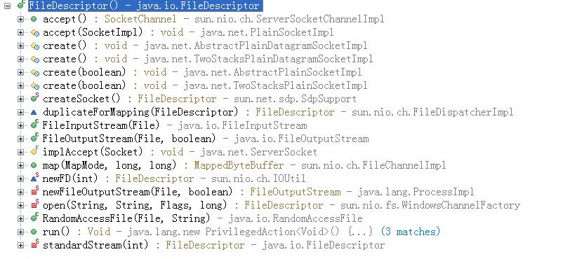

# Java中的文件句柄泄漏分析 #

日志中出现异常，排除系统设置的原因，只能说明是程序中存在文件句柄泄漏：

    IOException: Too many open files

在linux系统下可以使用如下命令查看某个进程打开的文件句柄：

    ls -la /proc/PID/fd
    lsof -p PID

也可以通过DUMP文件分析当前打开的文件句柄。

1、FileDescriptor

Javadoc对此类的描述：*文件描述符类的实例用作与基础机器有关的某种结构的不透明句柄，该结构表示开放文件、开放套接字或者字节的另一个源或接收者。文件描述符的主要实际用途是创建一个包含该结构的FileInputStream或FileOutputStream*

也就说打开一个文件输入输出流、新建一个Socket时，都会使用FileDescriptor来表示一个和底层系统相对应的文件句柄。FileDescriptor是一个普通的java类，两个成员变量fd和handle用来标识底层系统实际的文件句柄，验证如下：

使用FileDescriptor的地方有：


程序：
```java
public static void testFileDescriptor() throws IOException, NoSuchFieldException, SecurityException, IllegalArgumentException, IllegalAccessException {

    // FileInputStream
    File tmpInFile = File.createTempFile("int", ".tmp");
    tmpInFile.deleteOnExit();
    FileInputStream fis = new FileInputStream(tmpInFile);

    // FileOutputStream
    File tmpOutFile = File.createTempFile("out", ".tmp");
    tmpOutFile.deleteOnExit();
    FileOutputStream fos = new FileOutputStream(tmpOutFile);

    // RandomAccessFile
    File tmpRandFile = File.createTempFile("rand", ".tmp");
    tmpRandFile.deleteOnExit();
    RandomAccessFile acf = new RandomAccessFile(tmpRandFile, "rw");

    // ServerSocket & Socket
    ServerSocket serverSocket = new ServerSocket(8888);
    Socket socket = new Socket("localhost", 8888);

    System.out.println("open\n-------------------------------");
    System.out.println(String.format("FileInputStream : FileDescriptor[fd=%d handle=%d]", getFieldVal(fis, "fd", "fd"), getFieldVal(fis, "fd", "handle")));
    System.out.println(String.format("FileOutputStream: FileDescriptor[fd=%d handle=%d]", getFieldVal(fos, "fd", "fd"), getFieldVal(fos, "fd", "handle")));
    System.out.println(String.format("RandomAccessFile: FileDescriptor[fd=%d handle=%d]", getFieldVal(acf, "fd", "fd"), getFieldVal(acf, "fd", "handle")));
    System.out.println(String.format("ServerSocket    : FileDescriptor[fd=%d handle=%d]", getFieldVal(serverSocket, "impl", "fd", "fd"), getFieldVal(serverSocket, "impl", "fd", "handle")));
    System.out.println(String.format("Socket          : FileDescriptor[fd=%d handle=%d]", getFieldVal(socket, "impl", "fd", "fd"), getFieldVal(socket, "impl", "fd", "handle")));

    System.out.println("\nenter to continue:");
    System.in.read();

    fos.close();
    fis.close();
    acf.close();
    serverSocket.close();
    socket.close();
    System.out.println("\nclose\n-------------------------------");
    System.out.println(String.format("FileInputStream : FileDescriptor[fd=%d handle=%d]", getFieldVal(fis, "fd", "fd"), getFieldVal(fis, "fd", "handle")));
    System.out.println(String.format("FileOutputStream: FileDescriptor[fd=%d handle=%d]", getFieldVal(fos, "fd", "fd"), getFieldVal(fos, "fd", "handle")));
    System.out.println(String.format("RandomAccessFile: FileDescriptor[fd=%d handle=%d]", getFieldVal(acf, "fd", "fd"), getFieldVal(acf, "fd", "handle")));
    System.out.println(String.format("ServerSocket    : FileDescriptor[fd=%d handle=%d]", getFieldVal(serverSocket, "impl", "fd", "fd"), getFieldVal(serverSocket, "impl", "fd", "handle")));
    System.out.println(String.format("Socket          : FileDescriptor[fd=%d handle=%d]", getFieldVal(socket, "impl", "fd", "fd"), getFieldVal(socket, "impl", "fd", "handle")));
}
```

输出：
```java
open
-------------------------------
FileInputStream : FileDescriptor[fd=-1 handle=3584]
FileOutputStream: FileDescriptor[fd=-1 handle=3588]
RandomAccessFile: FileDescriptor[fd=-1 handle=3580]
ServerSocket    : FileDescriptor[fd=3572 handle=-1]
Socket          : FileDescriptor[fd=3568 handle=-1]

enter to continue:

close
-------------------------------
FileInputStream : FileDescriptor[fd=-1 handle=-1]
FileOutputStream: FileDescriptor[fd=-1 handle=-1]
RandomAccessFile: FileDescriptor[fd=-1 handle=-1]
ServerSocket    : FileDescriptor[fd=null handle=null]
Socket          : FileDescriptor[fd=null handle=null]
```

可以看到：

    对于FileInputStream/FileOutputStream/RandomAccessFile，使用handle来表示底层的文件句柄
    对于ServerSocket/Socket，使用fd来表示底层的文件句柄
    FileDescriptor的fd和handle的无效值是-1

2、其他使用文件句柄的地方：

JarFile和ZipFile中也持有文件句柄（或者确切的说是zip数据的地址？），但是不是用FileDescriptor表示的，而是使用jzfile来表示的，验证如下：

程序：
```java
public static void testJarFile() throws IOException, NoSuchFieldException, SecurityException, IllegalArgumentException, IllegalAccessException {
    JarFile jarFile = new JarFile(System.getProperty("java.home") + "/lib/rt.jar");
    System.out.println("open\n-------------------------------");
    System.out.println(String.format("JarFile : [jzfile=%d]", getFieldVal(jarFile, "jzfile")));
    
    jarFile.close();
    System.out.println("\nclose\n-------------------------------");
    System.out.println(String.format("JarFile : [jzfile=%d]", getFieldVal(jarFile, "jzfile")));
}
```

输出：
```java
open
-------------------------------
JarFile : [jzfile=45564856]

close
-------------------------------
JarFile : [jzfile=0]
```

可以看到：

    对于JarFile/ZipFile，它的无效值为0，所以jzfile应该是zip数据的地址

3、分析：

根据上面的验证，就可以使用MAT通过DUMP来分析那些文件句柄泄漏了。
    
    select * from java.io.FileDescriptor f where f.fd != -1 or f.handle != -1
    select * from instanceof java.util.zip.ZipFile z where z.jzfile != 0

4、注意：

如果是用URL("jar:")这个形式打开jar文件，那么默认的JDK会缓存打开的jar文件，在某些应用服务器上频繁的部署/解部署一个包含很多个jar的应用，就有可能导致出现最开始的那个异常。验证如下：

程序：
```java
    public static void testJarURLConnection() throws IOException, NoSuchFieldException, SecurityException, IllegalArgumentException, IllegalAccessException {
        // new URL("file://").openConnection().setDefaultUseCaches(false);
        File jar = new File(System.getProperty("java.home") + "/lib/rt.jar");
        URL url = new URL("jar:" + jar.toURI().toURL().toExternalForm() + "!/java/lang/String.class");

        URLConnection conn = url.openConnection();
        InputStream stream = conn.getInputStream();

        System.out.println("open\n-------------------------------");
        System.out.println(String.format("JarURLConnection : [jarFile.jzfile=%d]", getFieldVal(conn, "jarFile", "jzfile")));

        stream.close();
        System.out.println("close\n-------------------------------");
        System.out.println(String.format("JarURLConnection : [jarFile.jzfile=%d]", getFieldVal(conn, "jarFile", "jzfile")));
    }
```

输出：
```java
open
-------------------------------
JarURLConnection : [jarFile.jzfile=45564856]

close
-------------------------------
JarURLConnection : [jarFile.jzfile=45564856]
```

如果需要禁用缓存，那么在程序的开始处设置URLConnection的静态属性defaultUseCaches为false。去掉上面注释的一句，输出如下：
```java
open
-------------------------------
JarURLConnection : [jarFile.jzfile=45564856]

close
-------------------------------
JarURLConnection : [jarFile.jzfile=0]
```
不得不说JDK的这个设计很恶心。

-----------------
    Date: 2015/01/19
    Tags: Java FileDescriptor File handle leak JarFile ZipFile URLConnection JarURLConnection