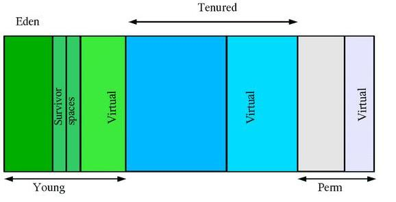

# 再遇OOM #
OOM并不常见，以前遇到的几次只是随手改掉，并没有总结详细的原因和解决方式。这次在分析消息缓存时，在特定场景下，一下子跑出好几个OOM，且错误消息都不一样：

1. java.lang.OutOfMemoryError: Java heap space
2. java.lang.OutOfMemoryError: GC overhead limit exceeded
3. java.lang.OutOfMemoryError: unable to create new native thread

第一种类型比较常见，第二、第三中类型很少遇到过。这次在FIX BUG的同时，打算对OOM进行一次较为深入的调查。本文记录了所有的调查结果，基于JDK 1.6和OpenJDK7.

# HotSpot VM的GC机制 #
JVM规范要求一个JVM实现必须包括一个垃圾收集器来回收无用对象。基于以下两个假设：

1. 大多数分配的对象会很快变得不可达
2. 只有很少的引用由老对象指向新生的对象

这两个假设被称为*弱年代假设*(绝大多数分配的对象会很快变得不可达)，实际中的系统也绝大数符合这两个假设描述的情况。基于以上假设，HotSpot VM采用分代垃圾收集机制，把JVM堆划分为两个物理区域：新生代(young generation)和老年代(old generation)，基本机构如下：

从上图可以看到，JVM堆实际上被划分为3个区域：

1. ** 新生代：**
绝大多数最新创建的对象都会被分配到新时代，与堆相比，新时代一般较小并且垃圾收集活动频繁。既然大部分对象在创建后会很快变得不可达，所以在一次新生代GC后，依然存活的对象的数量比较少了。新生代GC的特点是gc区域较小、gc次数频繁、且gc时间快速。进一步的，新生代又被分为伊甸园(Eden)和两段幸存者间（Survivor Space），刚刚分配的对象一般会位于伊甸园区，幸存者空间用于保存上次Minor GC之后依然存活的对象，进过几轮Minor GC依然存活的对象将会被转移至老年代。新生代GC也称为minor gc。

2. ** 老年代：** 
经过Minor GC依然存活的对象将会被放进（称为"promoted"或"tenured"）老年代。通常老年代会比新生代大，并且老年代的增长也会比较缓慢，对应的老年代的GC频率较低、并且时间会较长。老年代GC称为major gc或full gc。

3. ** 永久代：**
可以不把永久代看作分代层次中的一部分，只有HotSpot VM本身会使用永久代，主要用于保存元数据信息，比如类信息、字符串缓存等等。用户分配的对象不会被放到永久代的。

至JDK1.7为止，HotSpot VM一共支持4种垃圾收集器：

1. ** Serial GC：**
串行收集器只适用于单核CPU机器，它只使用一个线程执行GC。串行收集器不应该被使用在服务器应用上。一个可能的使用场景是需要在一个机器上起很多个JVM，此时可以考虑使用串行收集器。

2. ** Parallel GC：**
并行收集器使用多个线程执行GC，适合内存充足、多核的场景，由于它吞吐量优先，所以也称为"throughput gc"。早期版本的Parallel GC对老年代的GC依然是串行执行的，JDK 1.5之后，可以使用**Parallel Old GC**，老年代的GC也可以配置为并行执行，与Parallel GC相比，唯一的区别在于针对老年代的GC算法上，Parallel Old GC分为三步：标记-汇总-压缩(*mark-summary-compaction*)，汇总与清理（sweep）的不同之处在于，它将依然幸存

3. ** Mostly-Concurrent GC(CMS)：**
CMS收集器是一种以获取最短回收停顿时间为目标的收集器，也是一种并发收集器，采用Mark-Sweep算法，使用于响应时间时间要求比较苛刻的场景。CMS会比其他GC收集器占用更多的内存和CPU。

4. ** G1: **
G1收集器在JDK1.6提出，JDK1.7已经成熟，是目前最新的GC收集技术，它可以充分利用多核环境。G1最大的好处是性能，理论上它比上面讨论过的任何一种GC都要快，但是在生产环境中使用还是需要慎重测试。

