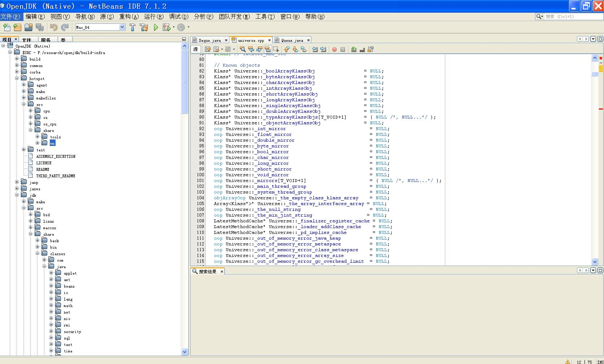

# 使用NetBeans阅读OpenJDK源码 #
最近需要了解一些JDK和JVM底层的实现细节，虽然自己以前从头编译出了一个完整的OpenJDK7，但是用什么看源码却很头疼，Java代码还好点，JMV的C/C++代码找起来就很费劲。

好的是从OpenJDK7开始，OpenJDK工程中就包含了一个OpenJDK C/C++部分(包括HotSpot的源码)的NetBeans工程，使用它看代码就方便了很多。本次使用NetBeans查看OpenJDK8的源码，步骤如下：

1、 安装MinGW：我的系统是XP的，所以需要预先安一个Unix-like工具，以前安装git时安装了MinGW，所以这次就使用上次安装的MinGW，具体安装参考[MinGW](http://sourceforge.net/projects/mingw/ "MinGW")

2、 安装JDK7：过程中需要一个Boot JDK，版本至少为7，这个安装就不多说了

3、 安装NetBeans C/C++环境：NetBean安装参考官网，我使用的版本是7.1.2。安装C/C++插件：工具-->插件-->可用插件，选择C/C++，然后点击安装就OK了

4、 安装TortoiseHg：OpenJDK的源码使用Mercurial管理，下载客户端[TortoiseHg](http://tortoisehg.bitbucket.org/ "TortoiseHg")，然后安装就行

5、 设置环境变量：

    set MinGW_HOME=D:\env\MinGW\
    set JAVA_HOME=D:\env\MinGW\jdk1.7.0_51
    set PATH=%MinGW_HOME%\bin;%MinGW_HOME%\mingw32\bin;%JAVA_HOME%\bin;%PATH%

6、下载OpenJDK源码：

    hg clone http://hg.openjdk.java.net/build-infra/jdk8 build-infra
    cd build-infra
    sh ./get_source.sh

7、 运行configure：

    sh ./configure --with-boot-jdk=D:\bessystem\env\Java\jdk1.7.0_51

8、导入NetBeans工程：configure完毕之后，打开NetBeans：文件-->打开项目-->选择build-infra\common\nb_native\nbproject，就可以将整个OpenJDK工程导入NetBeans了。查看源文件如下：

备注: 

1. %MinGW_HOME%\bin;%MinGW_HOME%\mingw32\bin必须放在PATH前面，后续的chkconfig会检查find命令，如果放到后面就会首先检测到windows自身的find，导致chkconfig失败
2. 期间chkconfig可能会因为找不到一些命令而失败，比如这次就碰到找不到cpio、zip、unzip，因为不是真正的编译，所以直接在%MinGW_HOME%\mingw32\bin目录copy一个其他命令，名字改为找不到命令的名字即可。

